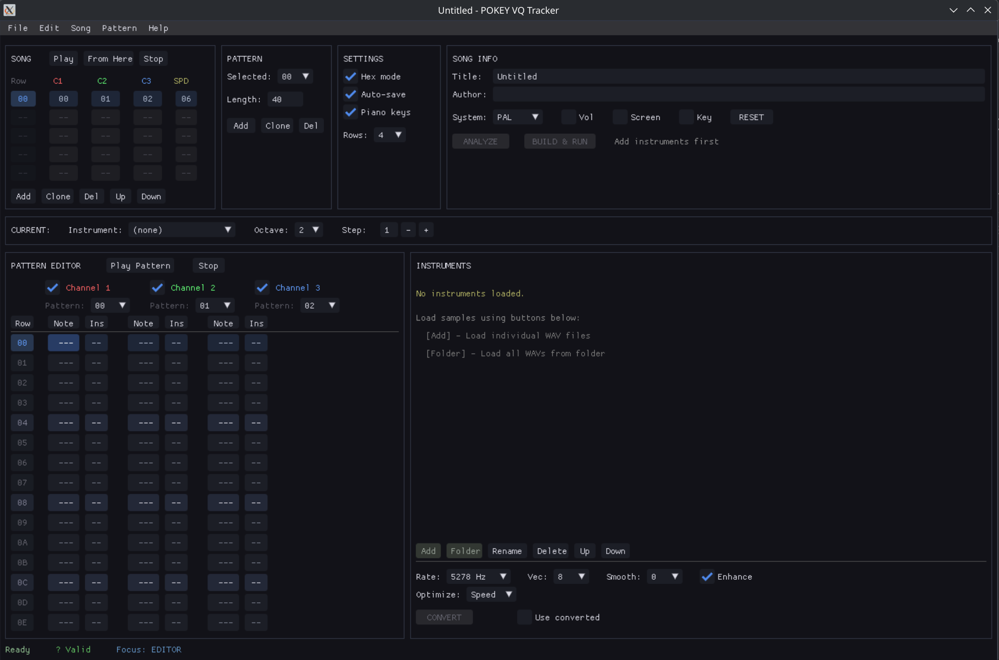
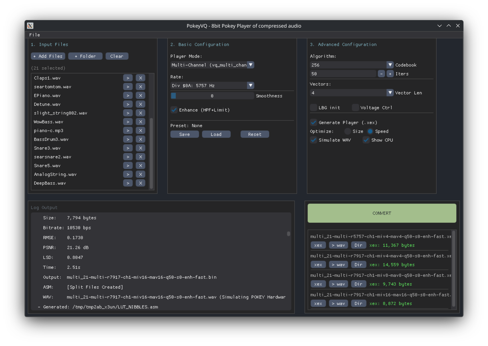

# POKEY VQ Tracker

A cross-platform music tracker for composing **sample-based music** targeting **Atari XL/XE 8-bit computers**. Create chiptunes using real audio samples compressed with Vector Quantization (VQ) technology.



## Features

- **4-channel polyphonic playback** using VQ-compressed samples
- **5 octaves (3 visible + 2 sub-octaves for pitch correction)** (C-1 to B-3) with pitch control via 8.8 fixed-point multipliers
- **Pattern-based sequencing** with variable-length event encoding
- **Real-time audio preview** that closely matches Atari hardware output
- **Export to Atari executable** (.XEX) via MADS assembler
- **Self-contained project format** (.pvq) with embedded samples
- **Multi-format audio import** — WAV, MP3, OGG, FLAC, M4A, and more
- **Timing analysis** to verify IRQ cycle budget before export
- **Optional per-note volume control** (at lower sample rates)

## Quick Start

### Download

Get the latest release from the [Releases](https://github.com/ilmenit/vq-tracker/releases) page.

### Workflow

1. **Load samples** — Add WAV/MP3 files as instruments
2. **Convert** — Process samples through VQ compression
3. **Compose** — Write music using patterns and the song editor
4. **Build** — Export to Atari executable (.XEX)

Press **F12** in the tracker to see all keyboard shortcuts.
Shortcuts are configurable via **keyboard.json** (auto-created on first run).

## Keyboard Controls

### Note Entry
| Keys | Function |
|------|----------|
| Z X C V B N M | Notes C D E F G A B (base octave) |
| S D G H J | Sharp notes C# D# F# G# A# |
| Q W E R T Y U I O P | Notes C-E (octave+1) |
| ` (backtick) | Note OFF |
| F1 / F2 / F3 | Select octave 1 / 2 / 3 |
| [ / ] | Previous / next instrument |

### Navigation
| Keys | Function |
|------|----------|
| Arrow keys | Move cursor |
| Tab / Shift+Tab | Switch channels |
| Page Up / Down | Jump 16 rows |
| Home / End | First / last row |

### Playback
| Keys | Function |
|------|----------|
| Space | Play / Stop toggle |
| Enter | Preview current row |
| F5 | Play song from start |
| F6 | Play pattern |
| F7 | Play from cursor |
| F8 | Stop |

## Timing & Performance

The Atari CPU runs at 1.77 MHz (PAL). The tracker includes timing analysis to ensure your music plays correctly.

| Sample Rate | Cycles/IRQ | Speed Mode | Size Mode |
|-------------|------------|------------|-----------|
| 7917 Hz     | ~224       | OK         | Over      |
| 5278 Hz     | ~336       | Safe       | OK        |
| 3958 Hz     | ~448       | Safe       | Safe      |

## Project Format

Projects are saved as `.pvq` files (ZIP archives) containing song data, embedded samples, and VQ conversion output. Projects are self-contained and can be shared with all assets included.

## Building from Source

### Requirements

- Python 3.8+
- MADS assembler ([download](http://mads.atari8.info/))

### Install Dependencies

```bash
pip install dearpygui numpy scipy sounddevice pydub soundfile pyinstaller
```

### Run from Source

```bash
python main.py
```

### Build Standalone Executable

```bash
# Linux / macOS
./build.sh dist

# Windows
build.bat dist
```

The distribution package will be created in `release/` with everything needed to run.

## VQ Converter

The tracker includes a bundled VQ converter for sample compression. For standalone batch processing or advanced options, see the separate project:

**[8bit-sound-compress](https://github.com/ilmenit/8bit-sound-compress)** — Vector Quantization audio compression for 8-bit systems



The standalone converter offers batch processing, advanced compression parameters, quality metrics, and a command-line interface.

## Documentation

- [User Guide](UserGuide.md) — Comprehensive documentation
- [Export Format](EXPORT_FORMAT.md) — Technical specification for the binary format
- [Changelog](CHANGELOG.md) — Version history

## License

MIT License, see [LICENSE](LICENSE) for details.
