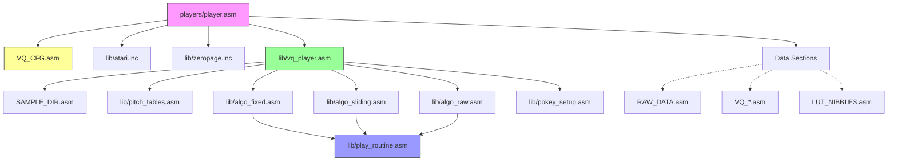

# PokeyVQ Player Architecture

This document details the internal structure, conditional compilation logic (`.ifdef`), and execution flow of the PokeyVQ player (`players/player.asm`). It is intended to guide refactoring and maintenance.

## 1. File Inclusion Hierarchy

The player is constructed using MADS assembly `icl` directives. The structure is strictly hierarchical, with `player.asm` serving as the root.

- **`player.asm`**: The executable container. Sets up memory, display list, and interrupts (NMI/IRQ).
- **`VQ_CFG.asm`**:  Generated by the CLI. Contains ALL configuration flags.
- **`lib/vq_player.asm`**: The reusable engine core. Handles initialization (`PokeyVQ_Init`) and the interrupt handler (`PokeyVQ_IRQ`).
- **`lib/algo_*.asm`**: Implementation of specific playback algorithms. Each must provide:
    - `fetch_next`: Logic to get the next data chunk.
    - `play_sample`: Logic to output audio (often by including `play_routine.asm`).
- **`lib/play_routine.asm`**: The lowest-level audio output logic. Included *inside* the algo files to inline code for performance.

---

## 2. Configuration & Conditional Logic (`.ifdef`)

The build is controlled by flags in `VQ_CFG.asm`. Table below explains how these flags trigger code paths.

### A. Algorithm Selection
Only one of these is defined.

| Flag | Included File | Logic Description |
|------|---------------|-------------------|
| `ALGO_FIXED` | `lib/algo_fixed.asm` | Standard VQ. Uses `VQ_INDICES` stream to look up `VQ_LO`/`VQ_HI` pointers and `VQ_LENS`. |
| `ALGO_SLIDING` | `lib/algo_sliding.asm` | Streaming Codebook. `VQ_INDICES` is used, but codebook pointers (`ptr_lo`, `ptr_hi`) shift conceptually over time (slide). |
| `ALGO_RAW` | `lib/algo_raw.asm` | No VQ. `sample_ptr` moves linearly through `RAW_DATA`. Error if data exceeds 64KB (improbable on Atari). |

### B. Channel Mode (`CHANNELS`)
Controls data packing and the `play_routine.asm` logic.

- **`CHANNELS = 1`**:
  - **Data**: `VQ_BLOB` (or `RAW_DATA`) is packed as 2 samples per byte (High Nibble, Low Nibble).
  - **Logic**: `process_sample` uses a state variable `nibble_state` to toggle between processing the high nibble and low nibble of the current byte pointed to by `sample_ptr`.
  - **Fast Mode**: Uses `LUT_NIBBLES` to convert nibbles to full POKEY volume bytes instantly.

- **`CHANNELS = 2`**:
  - **Data**:
      - *Standard*: 1 byte per frame. High nibble -> Channel 2 vol, Low nibble -> Channel 1 vol.
      - *Fast*: 2 bytes per frame (interleaved). Byte 0 -> Chan 1, Byte 1 -> Chan 2.
  - **Logic**: Reads 1 or 2 bytes, extracts 4-bit volumes and writes to `AUDC1`/`AUDC2`.

### C. Optimization (`USE_FAST_CPU`)
Prioritizes CPU speed over memory size.

- **Effect on Single Channel**:
  - Defines: Includes `LUT_NIBBLES.asm` (512 bytes).
  - Logic: Replaces bit-shifting (`lsr`, `and`) with `lda LUT_...,x`.
  
- **Effect on Dual Channel**:
  - Data: Expects interleaved 2-byte format which avoids bit shifting.
  - Logic: Simple fetches (`lda (ptr),y`) instead of complex masking/shifting.

### D. Multi-Sample Mode (`MULTI_SAMPLE`)
Enables playback of multiple distinct sound effects.

- **Files**: Includes `SAMPLE_DIR.asm` (Lo/Hi start and end tables).
- **Init**: `PokeyVQ_Init` expects Accumulator (A) to hold the sample index. It uses this to look up `stream_ptr` and `stream_end`.
- **End Behavior**: When a sample ends, `sample_finished` flag is set to `$FF` instead of looping or restarting.

### E. Pitch Control (`PITCH_CONTROL`)
Enables variable speed/pitch playback (e.g., for musical notes).

- **Files**: Includes `lib/pitch_tables.asm`.
- **Init**: `PokeyVQ_Init` preserves existing pitch settings if already set.
- **IRQ Logic**:
  - Uses 8.8 fixed-point math (`pitch_int`.`pitch_frac`) + `pitch_step` (16-bit).
  - Adding `pitch_step` to the accumulator determines how many source samples to advance (or repeat) per IRQ.
  - Loops `X` times per IRQ (where X = integer part of result):
      - Call `fetch_next`.
      - Or call `play_sample` if just playing current frame.
  - Skips `fetch_next` if pitch < 1.0 (slow playback) allows effectively "holding" a sample.

---

## 3. Core Execution Flow

### Initialization (`PokeyVQ_Init`)
1.  **Check Mode**:
    -   If `MULTI_SAMPLE`: Load pointers from `SAMPLE_START/END` tables based on register A.
    -   If Single: Load fixed pointers (`VQ_INDICES` or `RAW_DATA`).
2.  **Reset State**: Clear `sample_finished`, `nibble_state` (if mono), and pitch accumulators (if `PITCH_CONTROL`).
3.  **Hardware**: Call `pokey_setup` to silence channels and set frequency.

### Interrupt Handler (`PokeyVQ_IRQ`)
The IRQ drives playback at `PLAY_RATE` (e.g., 50Hz, 60Hz, or custom timer).

1.  **Save Registers**: A, X, Y.
2.  **ACK IRQ**: Clear hardware interrupt flag.
3.  **Pitch Calculation** (if `PITCH_CONTROL`):
    -   Add `pitch_step` to `pitch_frac`/`pitch_int`.
    -   Loop `X` times (where X = integer part of result):
        -   Call `fetch_next`.
        -   Or Call `play_sample` if just playing current frame.
4.  **Standard Playback** (if no Pitch):
    -   Check `sample_len`.
    -   If > 0: `play_sample`.
    -   If = 0: `fetch_next` to get new block, then exit.
5.  **Restore Registers & RTI**.

---

## 4. Memory Organization

This section describes the memory map of the active player. Note that the Display List and "Screen" are located at the beginning of the binary to keep the layout compact.

| Segment | Location | Description |
|---------|----------|-------------|
| **Zero Page** | `$80` - `$9F` | **Pointers**: `stream_ptr` (2), `sample_ptr` (2), `stream_end` (2) **State**: `nibble_state`, `sample_len`, `sample_finished` **Pitch**: `pitch_step` (2), `pitch_frac`, `pitch_int` |
| **Code** | `$2000` | **Display List**: The custom DL is defined here. **Code Entry**: `start` label logic follows immediately. **Core Engine**: `vq_player.asm` is included here. |
| **Data** | Follows Code | **VQ Tables**: `VQ_LENS` (256b), `VQ_LO/HI` (256b ea) **Codebook**: `VQ_BLOB` (Packed audio data) **Stream**: `VQ_INDICES` (Sequence) **LUT**: `LUT_NIBBLES` (512b, conditional) |

### Display System
The standard player uses a **minimal display list** to minimize DMA contention and CPU usage.
- **Location**: Defined at the start of the code segment (approx `$2000`).
- **Structure**: 3 instructions (Blank Lines) + Jump.
- **Screen Memory**: None. The standard player does **not** display text or graphics. It loops on `COLBK` (Background Color) updates to visualize CPU activity or status.

*Note: Addresses are relocatable, but Data usually follows Code.*
